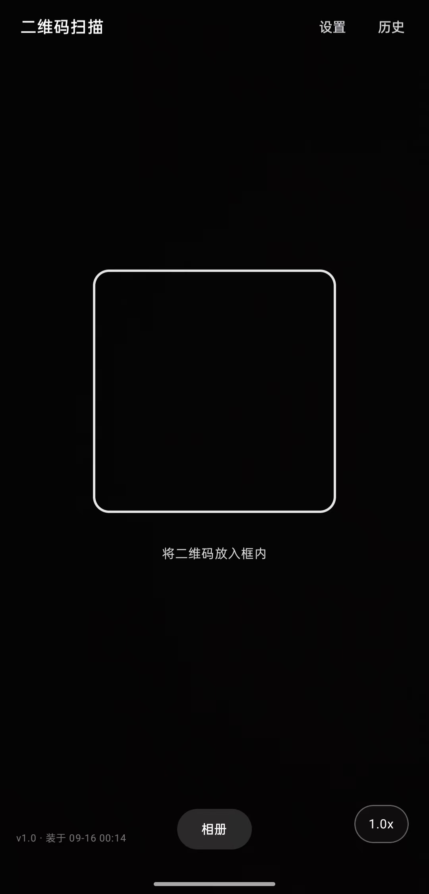
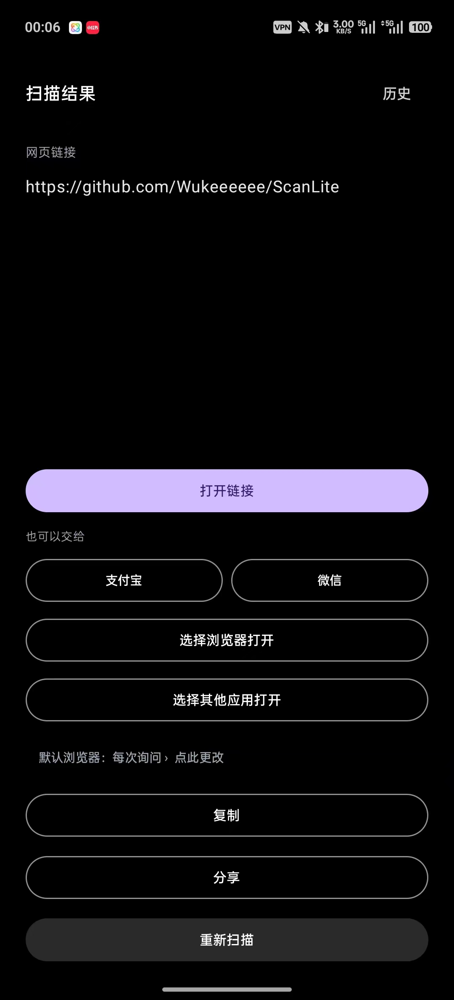
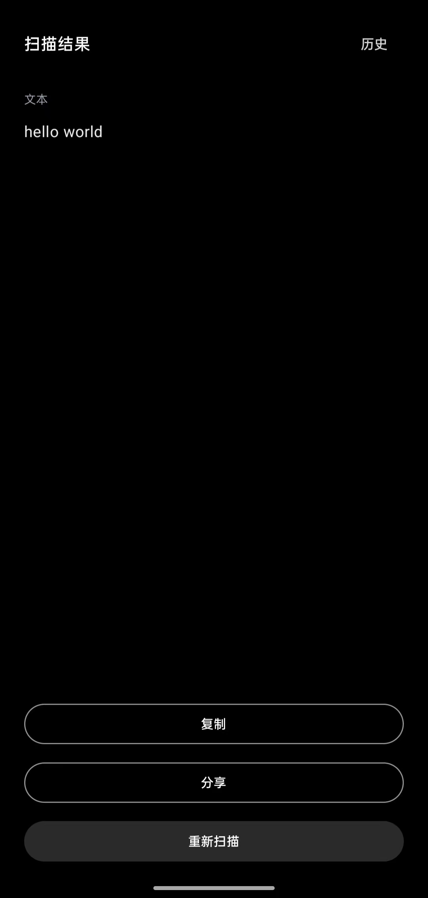
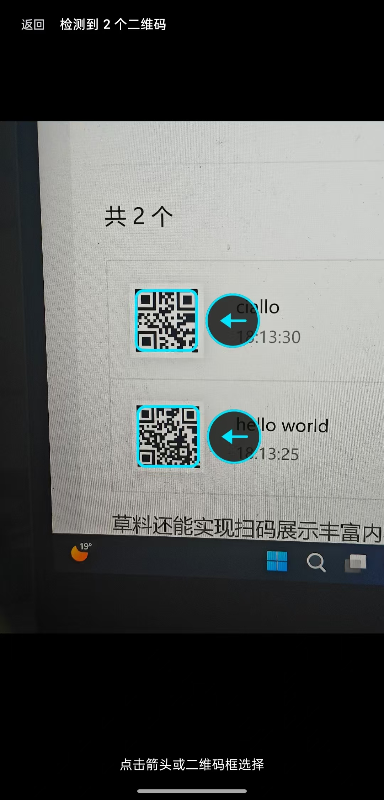

<p align="center">  
    
</p>

<h1 align="center">ScanLite</h1>

<p align="center">  
  <a href="../../releases/latest"></a>  
</p>

<p align="center">极简 Android 二维码 / 条形码扫描器 。 只申请相机权限，不联网、无广告</p>

> **项目仍在更新中。** 功能和界面还在打磨，后续版本可能调整行为。  
> 发现问题或想要什么功能，直接开 Issue。

## 截图

|                         扫描界面                         |                             扫描结果                            |                             纯文本                             |                           一屏多码                           |
| :--------------------------------------------------: | :---------------------------------------------------------: | :---------------------------------------------------------: | :------------------------------------------------------: |
|  |  |  |  |

## 功能

- **二维码 + 常见条形码都能扫**：QR，以及 EAN-13 / EAN-8 / UPC-A / UPC-E / Code128 / Code39 / ITF / Codabar
- **相机实时识别**；同一屏出现多个码时，点箭头或点方框选所需
- **相册选图**识别，一张图里有多个码也能逐个选
- **按「交给谁」分流**，而不是一律丢浏览器：
  - 普通网址 → 系统浏览器（也可以在结果页自己挑浏览器）
  - 微信码 → 复制内容 + 打开微信
  - 支付宝码 → 直接进支付宝扫一扫
  - 淘宝 / 京东 / 拼多多等专属链接 → 直接拉起对应 App，中途不会掉回浏览器
- **归属不唯一的码**会多给一行「也可以交给」，支付宝 / 微信自己选
- **「选择其他应用打开」是应用内列表**，不依赖系统选择器 —— 后者在部分国产 ROM 上会直接失灵
- 扫码历史、复制、分享
- **零联网**：Manifest 里显式移除了 `INTERNET` / `ACCESS_NETWORK_STATE` 权限
- 锁竖屏，打开就是相机

## 下载安装

1. 到 [Releases](../../releases/latest) 下载 `ScanLite-1.0.apk`
2. 手机点开安装；首次需要允许「安装未知来源的应用」
3. 系统要求：**Android 8.0（API 26）及以上**

> 签名用的是 debug key，方便直接覆盖升级。Google Play 不接受这种签名，自用 / 侧载没有问题。

## 自己编译

需要 JDK 17 + Android SDK。

```bash
echo "sdk.dir=D:/AndroidSdk" > local.properties   # 改成你自己的 SDK 路径
./gradlew assembleRelease                          # Git Bash
```

Windows 下也可以直接双击 `build.bat`（等价于跑单测 + assembleRelease + 把产物复制到仓库根目录）。

产物：仓库根目录 `ScanLite-<版本号>.apk`。

## 已知限制

- **微信的「扫一扫」调不起来。** 微信把二维码入口组件设成了 `exported=false`，任何第三方 App 都无法拉起它。  
  ScanLite 能做的是：复制内容并打开微信，最后一步请在微信里点「+ → 扫一扫」。这是微信的安全设计，不是 Bug。
- 微信支付码 `wxp://` 未对第三方开放，扫得出来但打不开。
- 部分国产 ROM（如 ColorOS）会向第三方隐藏「非默认浏览器」的查询结果：装了 Edge / Chrome，
  `queryIntentActivities` 也查不到，系统选择器里同样看不到。所以结果页的浏览器列表是
  「系统查询结果 ∪ 内置的已知浏览器清单」，选中后按包名直启。
- 同源问题：系统选择器在「**只有单一候选**」时会直接启动那个应用、根本不出界面。
  ColorOS 对 `http/https` 恰好只暴露系统浏览器一个，于是「选择其他应用打开」会静默变成
  「直接开浏览器」。所以那个按钮也是应用内自己列候选 —— 这样才能保证你真看见选项。

## 技术栈

Kotlin · Jetpack Compose · CameraX · ML Kit Barcode Scanning 17.3.0  
`minSdk 26` / `targetSdk 34`

## 许可证

MIT
